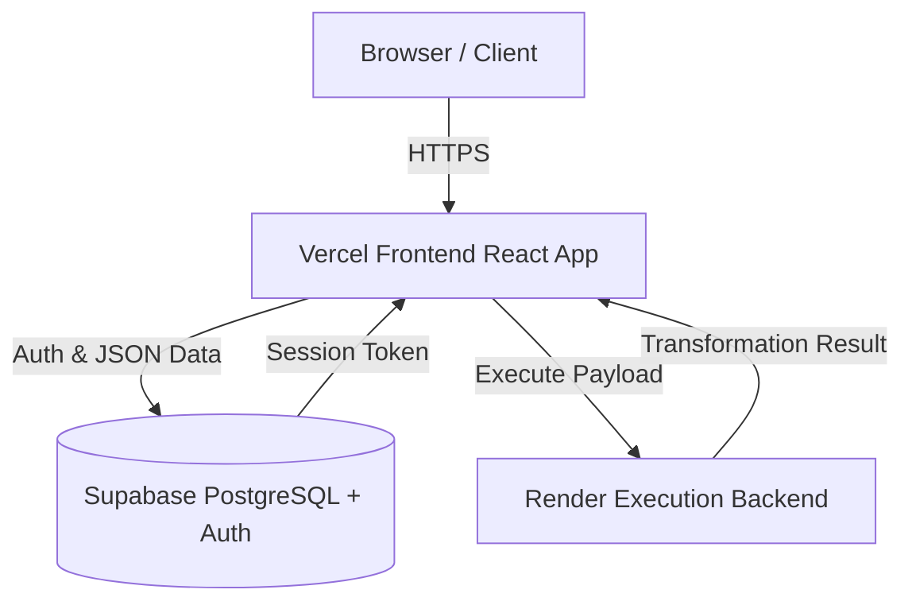
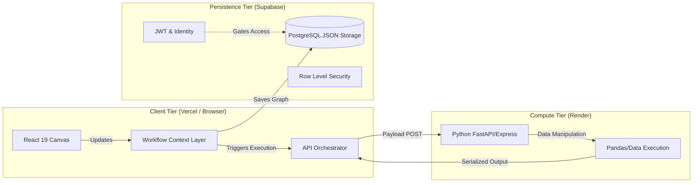
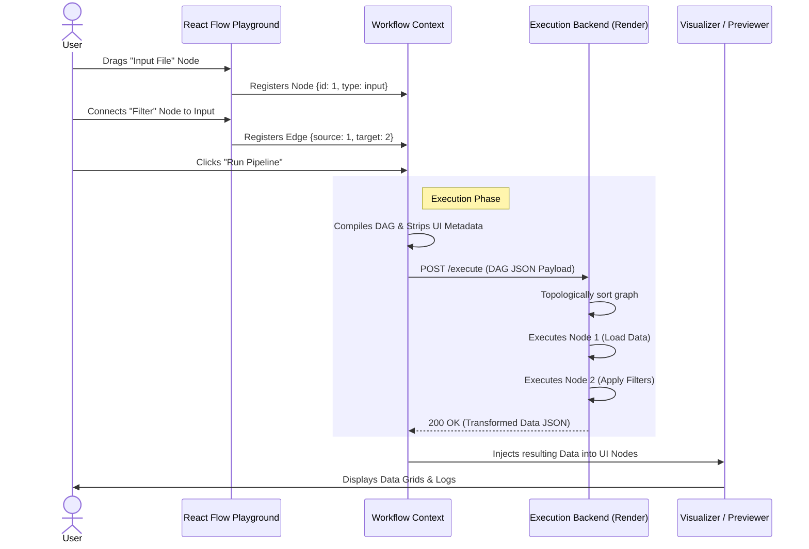
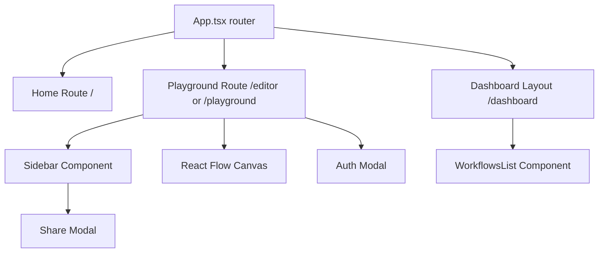
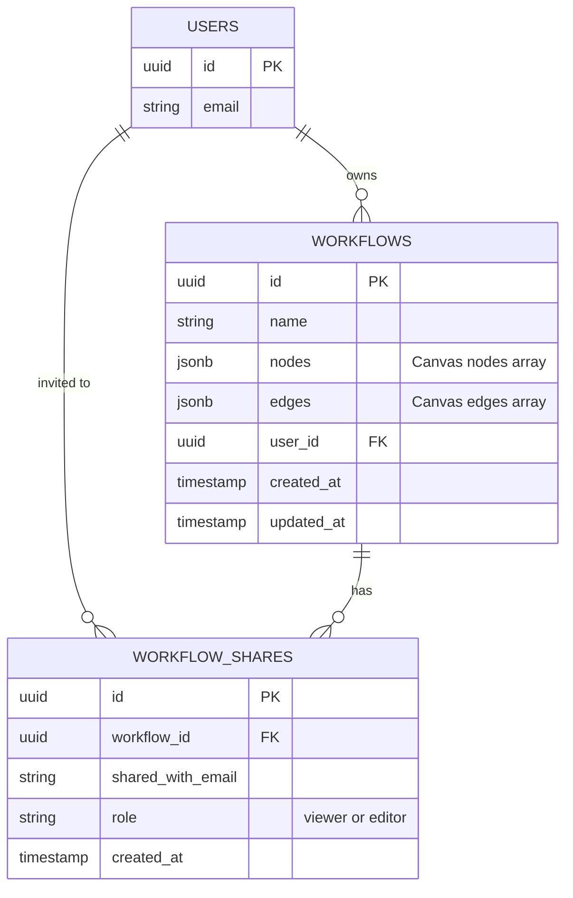
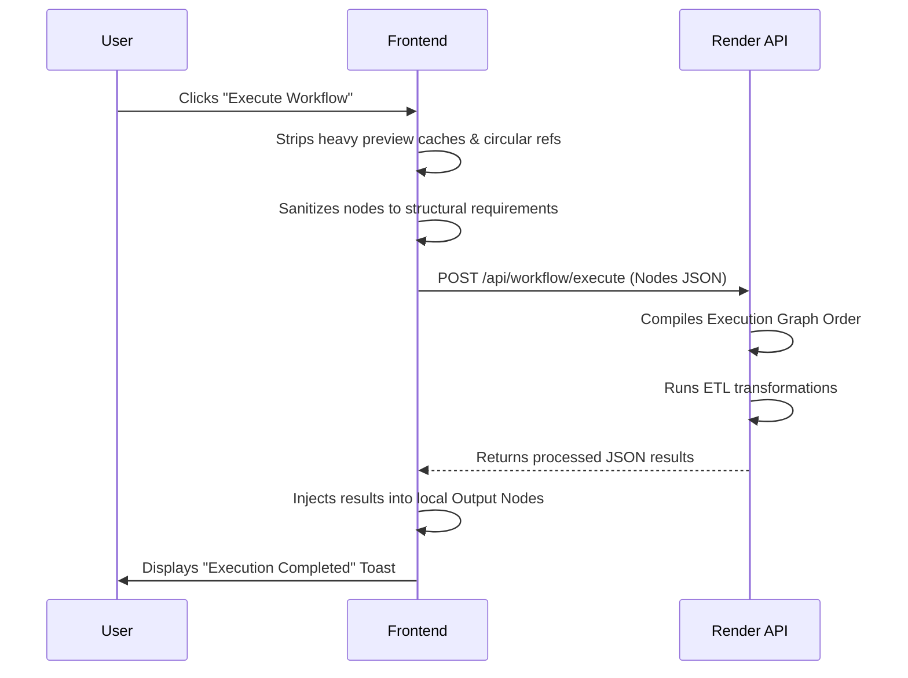
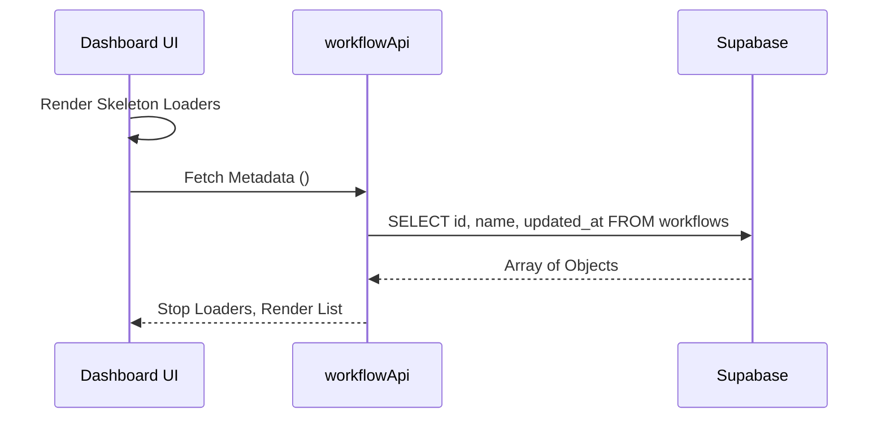
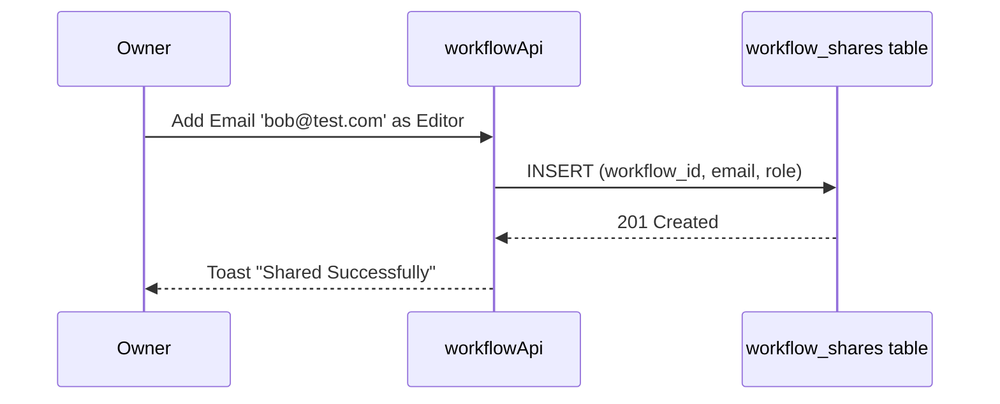

# 🚀 NodeFlow: ETL Workflow Builder

**NodeFlow** is a powerful, production-ready, Node-Based Visual Programming platform that enables users to visually design, execute, and share Extract, Transform, Load (ETL) workflows. Built with a rich interactive canvas, it allows data engineers, analysts, and developers to drag-and-drop functional nodes, wire them together, and instantly execute complex data transformations.

---

## 🔗 Live Demos
- **Frontend (Vercel):** [https://etl-workflow-creator-using-node-bas.vercel.app/](https://etl-workflow-creator-using-node-bas.vercel.app/)
- **Backend (Render):** [https://etl-workflow-creator-using-node-based.onrender.com](https://etl-workflow-creator-using-node-based.onrender.com)

---

## ✨ Key Features
- **Visual Canvas:** Intuitive drag-and-drop React Flow canvas for building node-based pipelines.
- **Secure Authentication:** Integrated Supabase Auth (Email/Password & Google OAuth).
- **Workflow Management:** Create, rename, delete, and persist workflows to the cloud.
- **Collaborative Sharing:** Share workflows with peers via specific email invites with "Viewer" or "Editor" Role-Based Access Control (RBAC).
- **Real-Time Execution:** Execute Python-based ETL logic in the cloud directly from the visual canvas.
- **Data Visualization:** Generate graphical visualizations (e.g., charts) directly from output nodes.
- **Premium UX/UI:** Polished glassmorphism aesthetics, responsive sidebar logic, smooth framer-motion animations, and resilient loading states.
- **Role-Based Permissions (RBAC):** Three-tier permission system — **Owner** (full access), **Editor** (edit + save, no rename), **Viewer** (read-only). Enforced in both UI and database (Supabase RLS).

---

## 🛠️ Tech Stack
- **Frontend:** React 19, Vite, React Flow (Canvas), Framer Motion, React-Hot-Toast.
- **Backend (ETL Engine):** Python, FastAPI/Express (Running on Render).
- **Database & Auth:** Supabase (PostgreSQL), Row Level Security (RLS).
- **Deployment:** Vercel (Frontend), Render (Backend).

---

## 🌍 System Architecture (High Level)

The system relies on a decoupled architecture where the React frontend serves as the interactive client, Supabase handles all state persistence and identity, and a Python microservice executes the heavy ETL operations.



### 1. Frontend & Backend Separation Architecture
Unlike tightly coupled monolithic apps, NodeFlow completely separates UI orchestration from processing power.



### 2. Playground Execution & Processing Flow
How the interactive playground specifically processes data operations:



### 3. Data Flow Strategy

## ⚙️ Low Level Design (LLD)

### API Interaction Flow
The frontend delegates API logic to specific encapsulated services (`workflowApi.ts` for Supabase, `WorkflowExecutionService.ts` for Render).

### State Management
- **AuthContext:** React Context globally managing the Supabase Session and User Object.
- **Local Component State:** Uses `useState` hooks for standard components, coupled with controlled form inputs.
- **React Flow State:** Handled natively by standard React hooks syncing nodes/edges before propagating to the DB.

### Process Flows
- **Creating Workflow:** The user clicks "Create", frontend issues an `INSERT` to the `workflows` table via `workflowApi`, Supabase returns the PK UUID, and the UI redirects to `/playground?id=UUID`.
- **Saving Workflow:** A debounced save system strips volatile data (`processedData` caches) before a direct `UPDATE` to Supabase. The `updateWorkflow` call skips any pre-fetch SELECT so it works for both owners and editors under RLS.
- **Loading Dashboard:** The dashboard avoids loading massive JSON blobs. It utilizes `getUserWorkflowsMetadata()` to exclusively select the `id`, `name`, and `updated_at` columns, rendering skeleton loaders until resolved.
- **Role Resolution:** When a workflow is opened, `getWorkflow()` performs a secondary query on `workflow_shares` to fetch the current user's `sharedRole`. This is passed to `getWorkflowRole()` in `src/utils/workflowPermissions.ts` which resolves the final `owner | editor | viewer` role used to gate all UI actions.

---

## 🧩 Component Architecture (Frontend)



---

## 🗄️ Class / Data Model Diagrams



---

## 🔒 Database Architecture (Supabase)

### Row Level Security (RLS) Logic
Strict Row Level Security is implemented directly in PostgreSQL to prevent data exposure. Backend APIs cannot arbitrarily read data without the correct user context.

1. **Owner Policy:** 
`auth.uid() = user_id` ensures a user can only Select, Update, or Delete rows where their explicit token UUID matches the row's `user_id`.
2. **Shared SELECT Policy:** 
Users can `SELECT` workflows if their `auth.jwt() ->> 'email'` matches the `shared_with_email` column in `workflow_shares`.
3. **Editor UPDATE Policy:** 
Users with `role = 'editor'` in `workflow_shares` can `UPDATE` the workflow. Required SQL:
```sql
CREATE POLICY "Editors can update shared workflows"
ON workflows FOR UPDATE
USING (
  EXISTS (
    SELECT 1 FROM workflow_shares
    WHERE workflow_shares.workflow_id = workflows.id
      AND workflow_shares.shared_with_email = auth.jwt() ->> 'email'
      AND workflow_shares.role = 'editor'
  )
);
```

---

## ⚡ Workflow Execution Diagram



---

## 🔄 Sequence Diagrams

### Load Dashboard Flow


### Share Workflow Flow


---

## 🚀 Deployment Architecture

### **Frontend (Vercel)**
- Uses Vite's high-speed build process (`npm run build`).
- Safely accesses environment variables at compile-time via `import.meta.env.VITE_SUPABASE_URL`.
- Enforces dynamic fallbacks to prevent hard crashes if Vercel configs are temporarily missed.

### **Backend (Render + Supabase)**
- **Render Engine:** Runs independent of data persistence. Acts as a stateless lambda-style executor.
- **Supabase DB:** Provides Edge functions capable, Webhook ready PostgreSQL persistence.

---

## 📈 Scalability & Future Design

NodeFlow is structurally prepared to scale. Here are the immediate future pipelines:

1. **Real-Time Collaboration:** Because the canvas uses a strict React Flow declarative JSON structure, Supabase Realtime (WebSockets) can be attached to the `workflows` table to enable Google Docs-style multi-player node editing.
2. **Background Job Processing:** Heavy execution requests can be shifted from synchronous API requests mapping to Render, into a queuing system like Celery or BullMQ, responding with a Job ID that the UI polls.
3. **Workflow Versioning:** By moving `nodes` and `edges` out of the primary `workflows` table and into a `workflow_versions` one-to-many table, users could roll back changes incrementally.
4. **Role-Based Access Control (RBAC):** Implemented — three-tier `owner/editor/viewer` system with Supabase RLS policies. Future: expand to Organization-level group permissions.

---

## 💻 Setup Instructions

### Local Development
1. Clone the repository: `git clone <repo-url>`
2. Navigate to the client directory: `cd client`
3. Install dependencies: `npm install`
4. Create a `.env.local` file in the `client` directory:
   ```env
   VITE_SUPABASE_URL=your_supabase_project_url
   VITE_SUPABASE_ANON_KEY=your_supabase_anon_key
   VITE_BACKEND_URL=http://localhost:8000 or your_backend_url
   ```
5. Start development server: `npm run dev`

### Production Deployment (Vercel)
1. Link your GitHub repository to Vercel.
2. Under "Environment Variables", add:
   - `VITE_SUPABASE_URL`
   - `VITE_SUPABASE_ANON_KEY`
   - `VITE_BACKEND_URL` (Pointing to your render instance)
3. Ensure the Build Command is `npm run build` and Output Directory is `dist` (default for Vite).
4. Save and Deploy!
